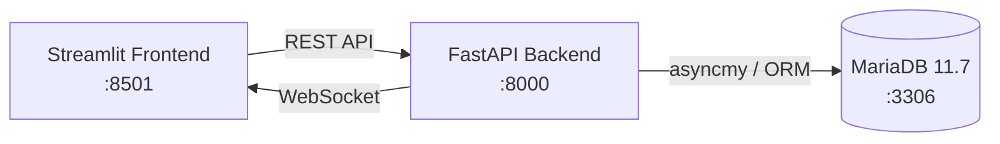

# Real-Time Data Analysis & Monitoring System

A real-time data analysis and monitoring system with WebSocket push, JWT authentication, role-based access control, and data visualization.

## Architecture

See [docs/architecture.md](docs/architecture.md) for detailed diagrams.



## Tech Stack

| Layer | Technology |
|-------|------------|
| Frontend | Streamlit 1.41, Plotly |
| Backend | FastAPI 0.115, Uvicorn, WebSocket |
| Auth | JWT (python-jose), bcrypt |
| ORM | SQLAlchemy 2.0 (async) |
| Database | MariaDB 11.7 + asyncmy |
| Migration | Alembic |
| Container | Docker + Docker Compose |
| CI/CD | GitHub Actions |

## Quick Start

### Prerequisites

- Docker & Docker Compose
- Git

### 1. Clone the repository

```bash
git clone https://github.com/houzeyu2683/realtime-data-monitoring-system.git
cd realtime-data-monitoring-system
```

### 2. Configure environment variables

```bash
cp .env.example .env
# Edit .env and update SECRET_KEY and other sensitive values
```

### 3. Start services

```bash
docker compose up -d
```

### 4. Open in browser

- Frontend: http://localhost:8501
- API Docs: http://localhost:8000/docs

## Test Account

| Username | Password | Role |
|----------|----------|------|
| admin | admin1234 | Admin |

The admin account is created automatically on first startup. Additional accounts can be registered via the frontend.

## Docker Commands

```bash
# Start
docker compose up -d

# View logs
docker compose logs -f backend

# Stop
docker compose down

# Stop and remove data
docker compose down -v
```

## API Documentation

Visit http://localhost:8000/docs (Swagger UI) after startup.

Key endpoints:

| Method | Path | Description |
|--------|------|-------------|
| POST | /api/v1/auth/register | Register a new user |
| POST | /api/v1/auth/login | Login and get JWT token |
| GET | /api/v1/data/ | List records (pagination / filter / sort) |
| POST | /api/v1/data/ | Create a data record |
| POST | /api/v1/data/import/csv | Bulk import via CSV |
| GET | /api/v1/analytics/ | Statistical analytics |
| GET | /api/v1/analytics/export/excel | Export data as Excel |
| WS | /ws?token=\<jwt\> | WebSocket real-time data stream |
| DELETE | /api/v1/users/{id} | Delete a user (Admin only) |

## Features

1. **User Management** — Registration, login, three roles (Admin / User / Viewer), role-based permissions
2. **Data Management** — CRUD, pagination, filtering, sorting, CSV/JSON bulk import
3. **Real-Time Monitoring** — WebSocket push every second, live line chart, anomaly markers
4. **Data Analytics** — Statistical summary, trend chart, category aggregation, Excel export
5. **System Administration** — User management, system logs, database status (Admin only)

## Sample Data

Import sample data via the frontend:

1. Log in and go to the **Data** page
2. Select the **Bulk Import** tab
3. Upload `sample_data.csv`

To regenerate sample data:

```bash
python scripts/generate_sample_data.py
```
