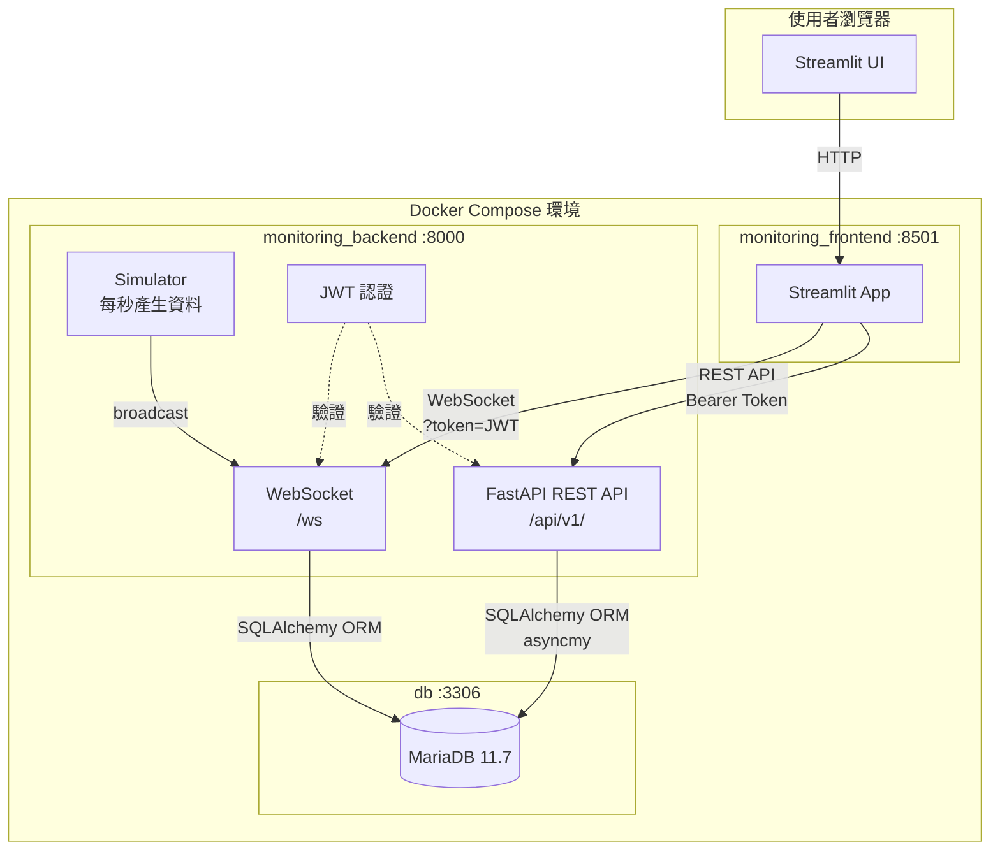
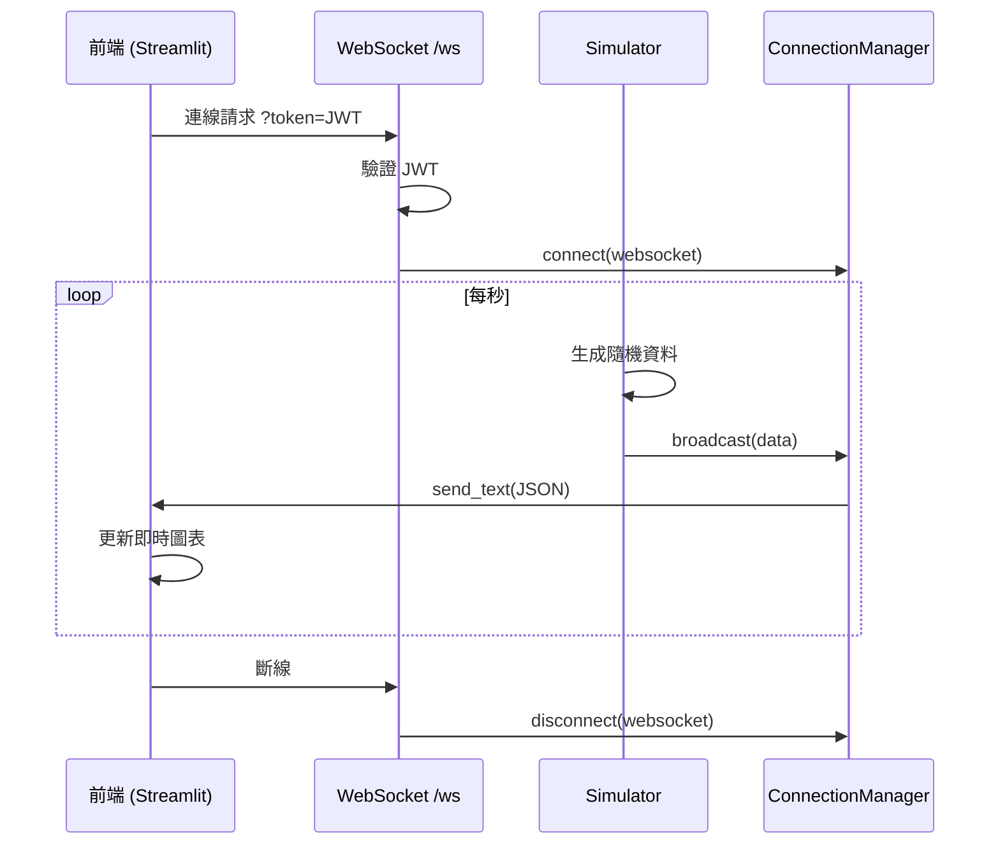

# 系統架構圖

## 整體架構



## API 模組結構

```mermaid
graph LR
    subgraph REST["/api/v1/"]
        A[/auth\n登入 / 註冊 / 查詢自身]
        U[/users\n用戶管理 CRUD]
        D[/data\n資料記錄 CRUD\nCSV/JSON 匯入]
        AN[/analytics\n統計分析\n趨勢 / Excel 匯出]
        AD[/admin\n系統日誌\nDB 狀態]
    end

    subgraph Roles[角色權限]
        ADMIN[Admin]
        USER[User]
        VIEWER[Viewer]
    end

    ADMIN -->|全部操作| REST
    USER -->|讀寫自己的資料| D
    USER -->|讀取| AN
    VIEWER -->|唯讀| D
    VIEWER -->|唯讀| AN
    ADMIN -->|專用| AD
    ADMIN -->|專用| U
```

## 資料流（即時監控）


